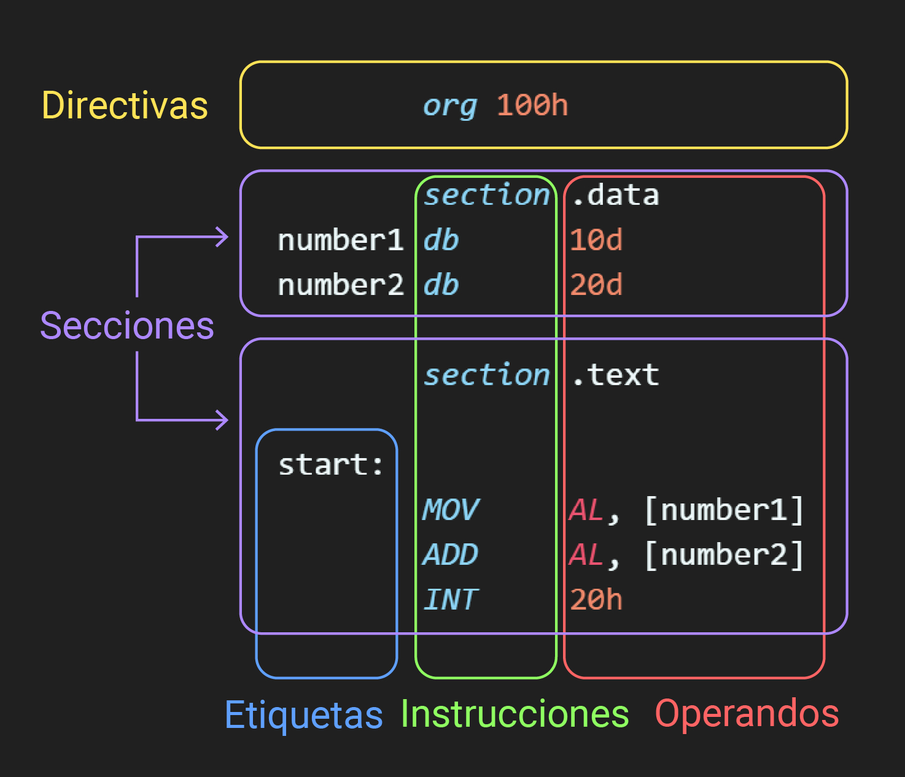
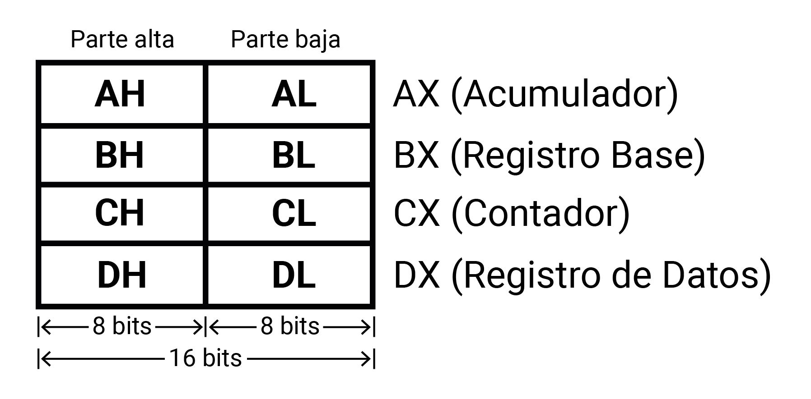
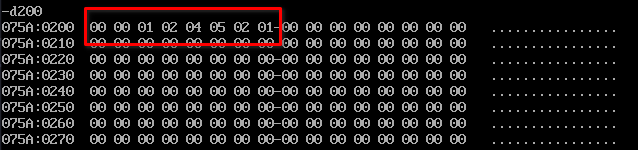

summary: Laboratorio 03 - Introducción a ensamblador y modos de direccionamiento
id: laboratorio-03-arquitectura
categories: Ensamblador, Direccionamiento, Thinkercad, Laboratorio
status: Published
authors: Ing. Gabriela Reynosa, Erika Paz, Kevin Escobar

# Laboratorio 3: Introducción a ensamblador y modos de direccionamiento

---

##  Objetivos

- Comprender la sintaxis básica y los componentes esenciales del código en ensamblador X86.
- Identificar y describir la función de los registros comunes en la arquitectura X86.
- Aprender a escribir instrucciones básicas en ensamblador X86 y compilarlas utilizando NASM.
- Ejecutar y depurar programas en ensamblador usando DOSBOX y debug.exe.
- Explorar y diferenciar los distintos modos de direccionamiento en ensamblador X86 y su aplicación práctica.

---

##  Introducción a Ensamblador

La programación en lenguaje ensamblador es una forma de programar a bajo nivel que se comunica directamente con el microprocesador de una computadora. En contraste con los lenguajes de alto nivel, como Python o Java, que están diseñados para ser más fáciles de entender y escribir, el ensamblador trabaja a un nivel más cercano al hardware físico de la máquina.

### **Características principales:**

- **Programación de bajo nivel**: El lenguaje ensamblador se considera de bajo nivel debido a que las instrucciones que escribe el programador se traducen directamente a código máquina, el cual es el lenguaje entendido por la CPU (Unidad Central de Procesamiento). Esta característica proporciona un mayor control sobre el hardware y permite optimizar el rendimiento de los programas.
- **Control directo del hardware**: Una de las ventajas principales de programar en ensamblador es la capacidad de controlar directamente el hardware de la computadora. Esto significa que se pueden escribir programas que interactúen con la CPU, la memoria y otros dispositivos periféricos de manera precisa y eficiente.

### Sintaxis:

El lenguaje de ensamblador X86 tiene una estructura y sintaxis específica que permite a los programadores escribir instrucciones que la CPU puede ejecutar directamente. Comprender esta sintaxis es crucial para desarrollar programas eficientes y funcionales. A continuación se describen los componentes clave de la sintaxis del ensamblador X86:



1. **Directivas**
    
    Las directivas son comandos que le indican al ensamblador cómo procesar el código. No son ejecutadas por la CPU, sino que preparan el entorno de ejecución. Por ejemplo, pueden definir constantes, reservar espacio en memoria o incluso controlar el proceso de ensamblaje.
    
2. **Secciones**
    
    En ensamblador X86, el código y los datos se organizan en secciones:
    
    - **section .text**: Esta es la sección principal donde se escribe el código ejecutable. Aquí se colocan todas las instrucciones que la CPU ejecutará.
    - **section .data**: Utilizada para declarar variables estáticas o constantes que no cambian durante la ejecución del programa. Esta sección almacena los datos que las instrucciones en la sección .text manipularán.
3. **Etiquetas** 
    
    Las etiquetas son identificadores que marcan puntos específicos en el código, como el inicio de una función o un loop. Funcionan como marcadores que pueden ser referenciados por instrucciones de salto y llamadas a funciones, facilitando la navegación y organización del código.
    
4. **Instrucciones**
    
    Las instrucciones son comandos que el procesador ejecuta directamente. Incluyen operaciones aritméticas, de manejo de datos, control de flujo, entre otros. Cada instrucción tiene un propósito específico y se expresa en la forma más cercana al lenguaje de la máquina que es comprensible para los humanos.
    
5. **Operandos**
    
    Los operandos son los valores con los que trabajan las instrucciones. Pueden ser inmediatos (valores directos), registros, o ubicaciones de memoria. Los operandos determinan las entradas y salidas de las instrucciones y son esenciales para la manipulación de datos.
    

---

## Registros de datos

Los registros de datos son componentes fundamentales en Ensamblador, ya que se usan en el manejo de operaciones aritméticas y el almacenamiento temporal de datos. Cada registro de datos es de 16 bits de longitud y puede ser tratado como dos registros de 8 bits independientes, es decir, están compuesto por dos subregistros de 8 bits: parte alta y parte baja.

Estos registros residen en la Unidad de Ejecución (EU), los cuales son:



1. **AX (Acumulador):** Este registro se destaca como el principal registro de trabajo. Se utiliza para almacenar resultados de operaciones aritméticas y otras operaciones. 
2. **BX (Registro Base):** BX se utiliza como un registro de base para direccionamientos de memoria. Es crucial para indicar dónde se almacenarán o recuperarán bloques de datos que serán procesados por el programa.
3. **CX (Contador):** CX cumple una doble función como contador y almacenador de datos. Se utiliza para llevar el conteo de ciclos repetitivos en un programa con instrucciones de bucle, además de almacenar temporalmente datos para su manipulación.
4. **DX (Registro de Datos):** DX desempeña un papel importante en operaciones aritméticas de multiplicación y división. Se utiliza para manejar los operandos y los resultados de estas operaciones. Además, en algunas operaciones, DX almacena la dirección de entrada/salida (E/S), lo que lo convierte en un registro versátil en el manejo de datos y control de dispositivos.

---

## Pasos para la compilación y DEBUG

1.  Guardar el código en lenguaje ensamblador x86 en un archivo con extensión **`.asm`**. Este archivo contendrá el programa en ensamblador.
2. Ensamblar el archivo guardado ejecutando el siguiente comando:
    
    ```bash
    nasm -f bin <nombre>.asm -o <nombre>.com
    ```
    
    Este comando genera un archivo ejecutable con extensión **`.com`** con el nombre indicado en el comando.
    
3. Abrir DOSBox, donde se podrá ejecutar y depurar el programa antes ensamblado. Se puede abrir DOSBox desde la terminal ejecutando el siguiente comando:
    
    ```bash
    dosbox .
    ```
    
4. Una vez que DOSBox esté abierto, ingresar el siguiente comando en el prompt para iniciar el depurador y cargar el programa:
    
    ```bash
    debug.exe <nombre>.com
    ```
    
    Esto abrirá el depurador de DOSBox y cargarás tu programa ensamblador para su depuración.
    

---

## Comandos útiles para DEBUG

- **`r` - Mostrar Registros:**
Muestra el estado actual de los registros de la CPU, lo que proporciona información sobre los valores almacenados en los registros de la CPU.
- **`t` - Ejecutar Instrucción:**
Ejecuta una sola instrucción del programa, permitiendo un paso a través del código para inspeccionar su ejecución paso a paso.
- **`t n` - Ejecutar Instrucciones:**
Ejecuta un número específico (**`n`**) de instrucciones del programa, lo que permite avanzar rápidamente a través del código.
- **`g` - Ejecutar Programa:**
Ejecuta todo el programa de forma continua hasta que alcanza un punto de interrupción o finaliza, lo que facilita la ejecución completa del programa.
- **`d 200` - Ver Memoria:**
Muestra el estado de la memoria en la dirección específica **`200h`**, lo que permite inspeccionar el contenido de la memoria en esa ubicación.
- **`q` - Salir:**
Sale del depurador DEBUG, regresando al prompt de la línea de comandos, lo que finaliza la sesión de depuración.

---

## Direccionamiento: Instrucción `MOV`

### **Concepto de Direccionamiento**

El direccionamiento en ensamblador se refiere a la manera en que se accede a los datos necesarios para ejecutar una instrucción. Los modos de direccionamiento determinan la ubicación de los operandos que una instrucción puede utilizar, ya sea en un registro, en memoria o como un valor inmediato. Estos modos son fundamentales para entender cómo se manipulan los datos dentro de un programa en ensamblador.

### **Instrucción MOV**

La instrucción **`MOV`** es una de las más básicas y utilizadas en ensamblador X86. Su función es mover datos de un lugar a otro. La sintaxis general es:

```nasm
MOV destino, fuente
```

 Donde el **`destino`** no puede ser un valor inmediato, sino más bien un registro o dirección de memoria.

### **Directivas de Tamaño: `byte`, `word`, y `dword`**

En ensamblador X86, es crucial especificar el tamaño de los datos con los que se está trabajando. Las directivas de tamaño byte, word, y dword se utilizan para este propósito:

- **byte:** Especifica que los datos son de 1 byte u 8 bits.
- **word:** Especifica que los datos son de 2 bytes o 16 bits.
- **dword:** Especifica que los datos son de 4 bytes o 32 bits.

La elección entre estas directivas depende del tamaño de los datos que se necesitan mover. Usar la directiva de tamaño adecuada es crucial para asegurar que el programa funcione correctamente y que no se produzcan errores de acceso a memoria.

---

## Modos de direccionamiento

Los modos de direccionamiento en ensamblador son métodos que especifican cómo una instrucción obtiene los operandos necesarios para su ejecución. Cada modo de direccionamiento ofrece un mecanismo diferente para acceder a los datos, ya sea directamente en el código, a través de registros, o mediante direcciones de memoria. La elección del modo de direccionamiento afecta la flexibilidad, la eficiencia y el tamaño del código de la máquina.

Entre los principales modos de direccionamiento tenemos los siguientes:

### Modo de direccionamiento inmediato

El modo de direccionamiento inmediato es uno de los más simples y directos en ensamblador. En este modo, el operando es un valor constante o literal que está codificado directamente en la instrucción. Este valor no se almacena en memoria o en un registro, sino que forma parte de la propia instrucción

Es posible realizar el direccionamiento inmediato con varios tipos de datos, por ejemplo:

1. **Decimales**

```nasm
MOV AH, 12d
```

Esta instrucción carga el valor decimal `12` en el registro `AH`  (parte alta del registro `AX`).

1. **Hexadecimales**

```nasm
MOV AL, 14ECh;
```

El código anterior carga en el registro de 8 bits `AL` el valor hexadecimal `14EC`.

O si se desea almacenar un valor hexadecimal que comience por una letra, por ejemplo `FF`, es necesario anteponerle el número cero, de lo contrario se obtendrá un error.

```nasm
MOV AL, 0FFh
```

1. **Binarios**

```nasm
MOV BH, 10010b
```

Con esta instrucción se ha cargado en el registro `BH` el valor binario `10010` .

<aside class="positive">
💡 Notar que las letras `d` , `h`   y `b` al final de los números a guardar describen el sistema de numeración que se utilizará.

</aside>

1. **Caracteres**

```nasm
MOV BL, "A"
```

Con esta instrucción, se carga el código **ASCII** de la letra `A` en el registro `BL` .

### Modo de direccionamiento por registro

En este modo de direccionamiento, usaremos los registros como operandos, de manera que pasemos el dato contenido de un registro a otro. Hay que considerar que el registro que usemos como fuente conservara su valor original, mientras que el registro de destino copiara el valor de la fuente. Por otro lado, una cosa muy importante sobre este modo es que ambos registros deben tener el mismo tamaño.

Por ejemplo:

```nasm
MOV CX, AX
```

En esta instrucción, se moverá el contenido del registro AX al registro CX. En este caso, AX y CX son los operandos y al realizarse la operación ambos registros contendrán el valor que AX tenia originalmente.

### Modo de direccionamiento absoluto

En el modo de direccionamiento absoluto además de registros también usamos direcciones de memoria para el manejo de datos, ya sea como fuente o como destino. Para hacerlo indicamos la dirección que deseamos usar entre corchetes.

```nasm
; Direccionamiento con registros de 8 bits/1 byte
  MOV [200h], CH; de registro a memoria
  MOV AH, [200h]; de memoria a registro
```

Cada dirección de memoria almacena 1 byte de información. Si deseamos almacenar valores mayores los bytes excedentes se guardaran en las direcciones siguientes utilizando la notación little endian.

```nasm
; DX actualmente tiene como valor 1241h
 
; Direccionamiento con registros de 16 bits/2 bytes
   MOV [210h], DX; de registro a memoria
   MOV BX, [210h]; de memoria a registro
```

En el ejemplo anterior, en la dirección hexadecimal `210` se guardara el valor hexadecimal `41` y la dirección  `211` tendrá el valor hexadecimal `12` .

Al pasarlo de memoria a registro, el contenido de la dirección `210h` se guarda en la parte baja de `BX` y el de la dirección `211h`  en la parte alta. Como resultado tanto `DX` como `BX` ****tendrán el mismo contenido.

Es importante señalar que el comando MOV **no permite usar dos direcciones de memoria como operandos al mismo tiempo**, por lo que si deseamos pasar un dato de una dirección de memoria a otra siempre debemos usar un registro como intermediario.

### Modo de direccionamiento indirecto

El modo de direccionamiento indirecto permite acceder a los datos mediante el uso de registros que contienen direcciones de memoria. En lugar de especificar un operando directamente en la instrucción, se utiliza el valor dentro de un registro como referencia a la memoria donde se encuentra el dato. Este modo es especialmente útil para manipular colecciones de datos como arrays o para implementar estructuras de datos complejas que requieren acceso dinámico.

En el direccionamiento indirecto, la CPU toma el valor de un registro, lo trata como una dirección de memoria y accede al contenido de esa dirección. Esto permite que las instrucciones trabajen con datos cuya ubicación exacta en memoria puede no ser conocida en tiempo de compilación, ofreciendo una gran flexibilidad en el manejo de datos.

Para este tipo de direccionamiento, los registros que pueden ser utilizados para almacenar la dirección de memoria son los registros base o índice (`BX`, `BP`, `SI` y `DI`).

```nasm
  MOV BP, 210h ; Se almacena la dirección de memoria a acceder
  MOV AL, [BP] ; Se obtiene el valor que se encuentra en esa dirección de memoria
```

En el ejemplo anterior,  en la dirección hexadecimal `210` se encuentra cargado el valor hexadecimal `41` , posteriormente se carga dicha dirección de memoria en el registro base `BP` con el cual  se hace el direccionamiento indirecto para obtener el valor guardado en la dirección `210` y se guarda en el registro `AL` , el cual finalmente obtiene el valor hexadecimal `41` .

---

## Tarea

Haciendo uso de los cuatro modos de direccionamientos abordados en esta guía de laboratorio, se deberá almacenar el número de carné del autor, colocando cada dígito en direcciones de memoria consecutivas, comenzando desde la dirección `200h` . Es importante que para cada direccionamiento realizado se deje indicado utilizando comentarios a qué tipo de direccionamiento corresponde.

Por ejemplo, para el alumno con carné `00124521` el resultado final esperado es el siguiente:



---

## Indicaciones de entrega

- La entrega se realizará a través de GitHub Classroom, en el repositorio asignado para las [prácticas de laboratorio](https://classroom.github.com/a/p3Yq-RKA).
- Crear una carpeta llamada "Laboratorio-03" dentro del repositorio. Esta carpeta será el contenedor para los archivos de esta práctica.
- Dentro de la carpeta "Laboratorio-03", crear un archivo llamado **`desarrollo.asm`**. En este archivo, colocar todos los ejemplos y ejercicios desarrollados durante la práctica de laboratorio.
- Crear un segundo archivo llamado **`tarea.asm`** dentro de la carpeta "Laboratorio-03". Este archivo debe contener la solución a la tarea propuesta.

```
└── Laboratorio-03
    ├── desarrollo.asm
    └── tarea.asm
```

- Realizar dos commits separados:
    - **Primer Commit:** Subir el archivo **`desarrollo.asm`** una vez completado el desarrollo durante la práctica.
    - **Segundo Commit:** Subir el archivo **`tarea.asm`** una vez completada la tarea propuesta.
- Copiar el enlace de su repositorio en el entregable llamado “[Nota] Laboratorio 03 - Introducción a ensamblador y modos de direccionamiento” correspondiente a la práctica de laboratorio que está colocado en el e-campus.

---

## Rúbrica

| **Criterios** | **Porcentaje** |
| --- | --- |
| Desarrollo | 30% |
| Tarea | 50% |
| Entrega en GitHub | 20% |
| **Total** | **100%** |